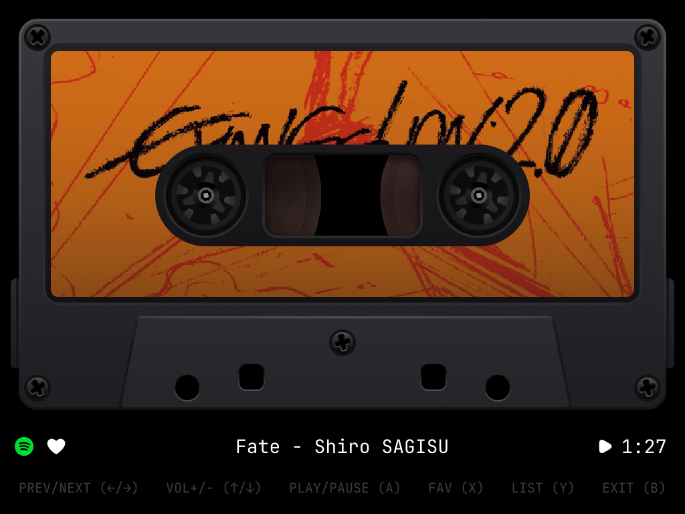
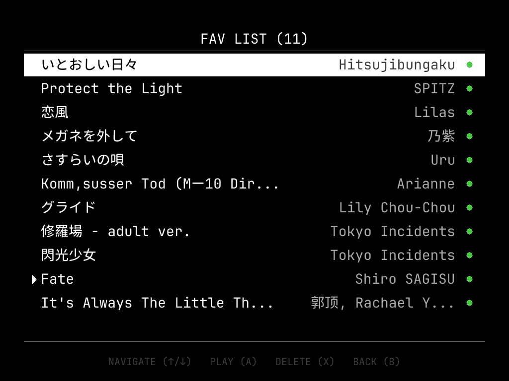
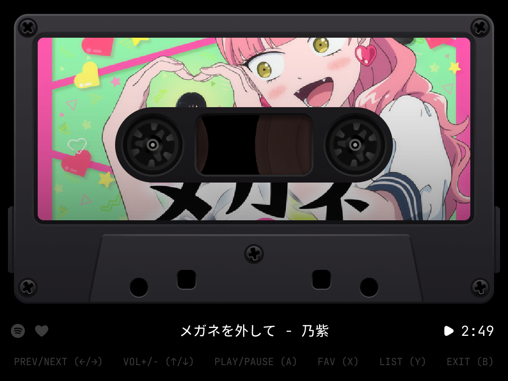
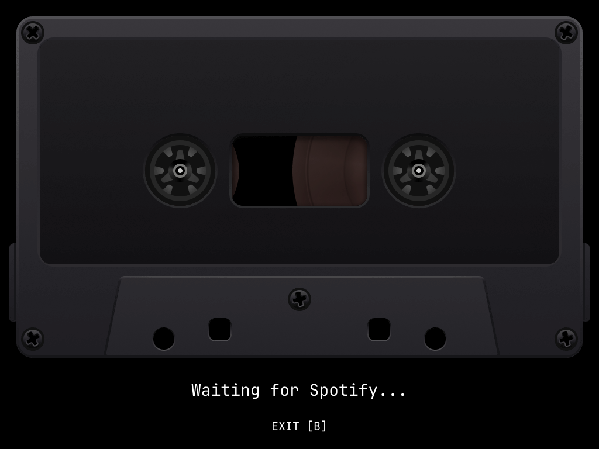

# SideB

SideB is a retro cassette-style music player for [TrimUI Brick](https://trimui.com) with Spotify Connect, offline favorites, and local MP3 playback.

Latest release: `v1.0.6`

- Major performance optimization: 3x faster rendering (87ms → 25ms per frame at 30 FPS)
- Eliminated CPU busy-waiting in network thread, reduced idle polling overhead
- Fast alpha blending with bit-shift approximation for ARM, optimized drawing primitives
- Reduced device temperature by ~25°C during playback

## Screenshots 📸

<table>
  <tr>
    <td align="center">
      <br>
      <strong>Spotify connecting</strong>
    </td>
    <td align="center">
      <br>
      <strong>FAV LIST</strong>
    </td>
  </tr>
  <tr>
    <td align="center">
      <br>
      <strong>Offline playback</strong>
    </td>
    <td align="center">
      <br>
      <strong>Waiting screen</strong>
    </td>
  </tr>
</table>

## Features ✨

### Spotify streaming 🎧

- Turns the TrimUI Brick into a Spotify Connect receiver on your local network
- Shows cover art, playback state, and cassette animation directly on `/dev/fb0`
- Supports hardware controls for play, pause, skip, volume, favorites, and list navigation

### Offline FAV list 💾

- Save the current track with `X`
- Browse and manage favorites in the fullscreen `FAV LIST`
- Play downloaded favorites locally with shuffle, previous, and next track controls

### Local uploads 📥

- Drop MP3 files into `data/imports/`
- SideB imports tags and cover art automatically
- Imported tracks are added to `FAV LIST` and behave like local favorites

## How It Works 🧠

The app consists of two components:

- **[go-librespot](https://github.com/devgianlu/go-librespot)**: Spotify Connect backend — handles authentication, audio streaming, and exposes a local HTTP/WebSocket API on port `3678`
- **spotify-ui-rs** (this repo): Rust framebuffer UI — reads input from `/dev/input`, renders the cassette scene to `/dev/fb0`, and communicates with `go-librespot` via its local API

### Offline playback pipeline

When a user marks a track as a favorite, the app searches for multiple matching candidates on YouTube using [yt-dlp](https://github.com/yt-dlp/yt-dlp), scores them by duration match against Spotify metadata, title similarity, and channel quality, then downloads the best match as an MP3 file on the SD card. After download, the actual file duration is validated against the Spotify track length to reject mismatched results. Downloads use a bundled FFmpeg-compatible audio transcoder with MP3 encoder support. Cached audio is played back through the device's built-in `ffmpeg → aplay` subprocess pipeline. Cover art is fetched from the Spotify CDN or copied from the local cover cache. Incomplete downloads are automatically resumed on the next app launch.

For manual local playback, users can also drop MP3 files into `data/imports/`. SideB scans that folder automatically, reads MP3 metadata, moves the file into `data/music/`, extracts embedded cover art with the device's system ffmpeg when available, and adds the track to `FAV LIST` as a managed local item.

**Important**: The app does **not** intercept, decrypt, or extract audio from Spotify streams. Spotify playback and offline caching use entirely separate audio paths.

## Offline Playback & Legal Notice ⚠️

This project provides an offline caching mechanism strictly for **personal, non-commercial use**. By using this feature, you acknowledge and agree to the following:

- **No content is hosted or distributed by this project.** All audio files are cached locally on the user's own device and are never uploaded, shared, or made available to third parties.
- **The project does not circumvent any DRM or copy protection.** Spotify audio streams are not intercepted or recorded. Offline caching relies on publicly available content retrieved via [yt-dlp](https://github.com/yt-dlp/yt-dlp) from YouTube.
- **Users are solely responsible for ensuring their use complies with applicable copyright laws and the terms of service of any third-party platform** (including YouTube and Spotify). The authors and contributors of this project assume no liability for how the software is used.
- **If you are a rights holder** and believe this project facilitates infringement of your rights, please [open an issue](https://github.com/CharlexH/SideB/issues) and we will address it promptly.

This software is provided as-is for educational and personal use. It is not intended to promote or facilitate unauthorized copying or distribution of copyrighted material.

## Requirements ✅

- TrimUI Brick
- NextUI, Stock OS, or [CrossMix OS](https://github.com/cizia64/CrossMix-OS) `1.1.1+`
- Spotify Premium account
- Wi-Fi on the same network as your Spotify client (for streaming mode)

## Controls 🎮

| Button | Action |
|--------|--------|
| **A** | Play / Pause |
| **← / →** | Previous / Next track |
| **↑ / ↓** | Volume up / down |
| **X** | Favorite, or press twice to remove a favorite |
| **Y** | Open / close playlist |
| **B** / **MENU** | Exit app |

## Usage 🚀

### Spotify streaming

1. Launch **SideB** from the TrimUI app menu.
2. Open Spotify on your phone, desktop, or tablet.
3. Pick **TrimUI Brick** from Spotify Connect.
4. Use the hardware buttons on the device for playback, volume, favorites, and list access.

### Offline FAV list

1. Start playback from Spotify Connect.
2. Press **X** to add the current track to favorites.
3. Wait for the background download to finish.
4. Press **A** on the device to start local playback from the downloaded library, or press **Y** to pick a downloaded track from `FAV LIST`.

### Local uploads

Copy `.mp3` files into the `data/imports/` folder inside the app directory:

```text
NextUI   -> /mnt/SDCARD/Tools/tg5040/SideB.pak/data/imports/
Stock    -> /mnt/SDCARD/Apps/SideB/data/imports/
CrossMix -> /mnt/SDCARD/Apps/SideB/data/imports/
```

SideB scans that folder automatically at startup and while running. Imported files are moved into `data/music/`, then added to `FAV LIST` and treated like downloaded local tracks.

Notes:

- Current manual import support is `MP3` only.
- Embedded cover art is preferred. If no embedded cover exists, SideB will try to use a same-name sidecar image next to the MP3 during import.
- Press **X** once to show the remove confirmation, then press **X** again to actually remove the track from favorites.
- If you remove the track that is currently playing locally, SideB keeps the managed file until playback moves away from that track. If you favorite it again before switching tracks, the cached file is preserved.

## Troubleshooting: Downloads Failing

If downloads fail with `Sign in to confirm you're not a bot` in the log (`/tmp/sideb.log`), YouTube needs valid cookies.

**Use Firefox** (recommended — Chrome rotates cookies on export, making them expire immediately):

1. Install [Firefox](https://www.mozilla.org/firefox/) and log into YouTube
2. Install [yt-dlp](https://github.com/yt-dlp/yt-dlp) (`brew install yt-dlp` / `winget install yt-dlp`)
3. Export cookies and copy to the device:
   ```bash
   yt-dlp --cookies-from-browser firefox --cookies cookies.txt -s "https://www.youtube.com/watch?v=dQw4w9WgXcQ"
   ```
4. Copy `cookies.txt` to the device SD card as `data/yt-dlp-cookies.txt`

Restart SideB and pending downloads will resume automatically.

> **Why not Chrome?** Since late 2024, Chrome automatically invalidates exported cookies as a security measure. Firefox does not have this limitation.

## Build 🔧

### Rust UI (current)

```bash
git clone https://github.com/CharlexH/SideB.git
cd SideB/spotify-ui-rs
cargo build --release --target aarch64-unknown-linux-musl
cp target/aarch64-unknown-linux-musl/release/sideb ../package/SideB.pak/sideb
```

### Required runtime files (not tracked in git)

- `package/SideB.pak/go-librespot` — Spotify Connect backend binary
- `package/SideB.pak/ffmpeg-lite` — bundled FFmpeg-compatible audio transcoder with MP3 encoder support; a minimal audio-focused build is sufficient
- `package/SideB.pak/yt-dlp` — YouTube audio downloader (aarch64 binary)
- `package/SideB.pak/resources/ca-certificates.crt` — TLS root certificates
- `package/SideB.pak/resources/font_mono.ttf` — UI font

## Package Releases 📦

Build all release archives:

```bash
./scripts/package.sh
```

This produces:

- `dist/SideB-<version>-nextui.zip`
- `dist/SideB-<version>-stock.zip`
- `dist/SideB-<version>-crossmix.zip`

Each archive already contains the correct SD-card root layout:

- `nextui`: `Tools/tg5040/SideB.pak/...`
- `stock`: `Apps/SideB/...`
- `crossmix`: `Apps/SideB/...`

Supported in this release:

- `NextUI` — validated on device
- `Stock` — package layout and launcher verified
- `CrossMix` — package layout and launcher verified

## Deploy 🚀

Manual install paths:

```text
NextUI   -> /mnt/SDCARD/Tools/tg5040/SideB.pak/
Stock    -> /mnt/SDCARD/Apps/SideB/
CrossMix -> /mnt/SDCARD/Apps/SideB/
```

Launch **SideB** from the TrimUI app menu, then select **TrimUI Brick** from Spotify Connect on another device.

## GitHub Release 🏷️

Public releases attach three installable archives:

- `SideB-<version>-nextui.zip`
- `SideB-<version>-stock.zip`
- `SideB-<version>-crossmix.zip`

The NextUI Pak Store consumes the `nextui` archive via [`pak.json`](pak.json).

Current release tag: `v1.0.6`

## Repo Layout 🗂️

```text
spotify-ui-rs/                  Rust UI source
package/SideB.pak/              Local runtime staging folder and source assets
package/SideB.pak/data/         Runtime config copied into release packages
package/SideB.pak/resources/    UI images, icons, and fonts
packaging/                      Platform wrappers and release metadata
scripts/package.sh              Multi-platform release packager
```

## Configuration ⚙️

Main config: [`package/SideB.pak/data/config.yml`](package/SideB.pak/data/config.yml)

```yaml
device_name: "TrimUI Brick"
device_type: "speaker"
audio_backend: "alsa"
audio_device: "default"
bitrate: 160
volume_steps: 100
initial_volume: 80
zeroconf_enabled: true
```

The UI communicates with `go-librespot` at `http://127.0.0.1:3678`.

## Credits & Third-Party Software 🙏

This project builds upon the following open-source projects:

| Project | License | Usage |
|---------|---------|-------|
| [go-librespot](https://github.com/devgianlu/go-librespot) | GPL-3.0 | Spotify Connect backend |
| [yt-dlp](https://github.com/yt-dlp/yt-dlp) | Unlicense | YouTube audio search and download for offline caching |
| [FFmpeg](https://ffmpeg.org/) | LGPL-2.1+ / GPL-2.0+ | Audio decoding and playback pipeline |
| [CrossMix OS](https://github.com/cizia64/CrossMix-OS) | — | Firmware base for TrimUI devices |

Hardware: [TrimUI Brick](https://trimui.com)

Release archives also include:

- `LICENSES/NOTICE.md`
- `LICENSES/THIRD_PARTY_SOURCES.md`
- Full upstream license texts for bundled binaries

Before publishing a GitHub release, record the exact upstream versions and checksums of the bundled third-party binaries in `LICENSES/THIRD_PARTY_SOURCES.md`.

## License 📄

Apache-2.0. See [LICENSE](LICENSE).

## Disclaimer ⚖️

THE SOFTWARE IS PROVIDED "AS IS", WITHOUT WARRANTY OF ANY KIND, EXPRESS OR IMPLIED. THE AUTHORS ARE NOT RESPONSIBLE FOR ANY MISUSE OF THIS SOFTWARE OR FOR ANY VIOLATION OF THIRD-PARTY TERMS OF SERVICE OR APPLICABLE LAWS. USE AT YOUR OWN RISK.
